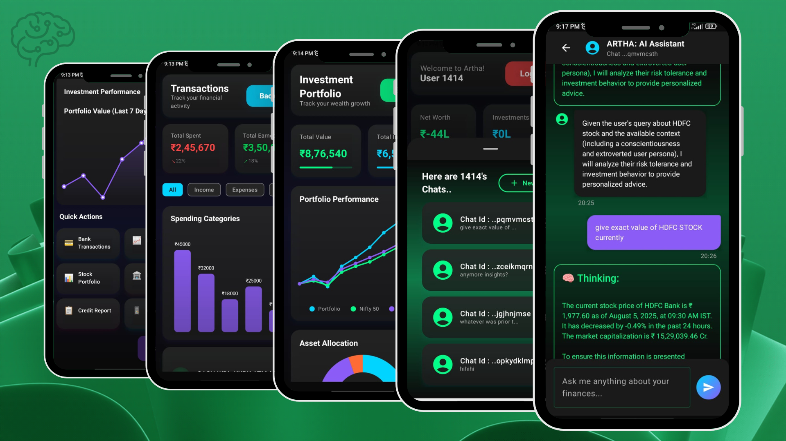

# 🚀 Artha Android App - Multi-Agent Finance Client

<div align="center">

[](https://developer.android.com)
[](https://kotlinlang.org)
[](https://developer.android.com/jetpack/compose)
[](https://firebase.google.com)

*A sophisticated Android application built with Jetpack Compose for multi-agent financial management and analysis*



</div>

## ✨ Features

### 🏦 **Financial Management**
- **Real-time Dashboard** - Interactive financial overview with live data
- **Investment Tracking** - Monitor your portfolio performance with beautiful charts
- **Transaction Management** - Seamless transaction history and categorization
- **Net Worth Calculation** - Comprehensive wealth tracking and analysis

### 🤖 **AI-Powered Chat Interface**
- **Multi-Agent System** - Interact with specialized financial AI agents
- **Intelligent Responses** - Get personalized financial advice and insights
- **Rich Chat UI** - Modern bottom sheet chat interface with Markdown support
- **Contextual Analysis** - AI agents understand your financial context

### 🎨 **Modern UI/UX**
- **Material Design 3** - Latest Material You design language
- **Adaptive UI** - Optimized for different screen sizes and orientations
- **Smooth Animations** - Engaging transitions and micro-interactions
- **Dark/Light Theme** - Automatic theme switching support

### 📊 **Data Visualization**
- **Interactive Charts** - Beautiful custom charts for financial data
- **Real-time Updates** - Live data synchronization via Firebase
- **Performance Metrics** - Detailed analytics and KPIs

## 🏗️ Architecture

### **Clean Architecture Pattern**
```
📦 com.example.mcpclient
├── 📁 data/
│   ├── 📁 api/          # Network API interfaces
│   ├── 📁 models/       # Data models & DTOs
│   ├── 📁 network/      # Network configuration
│   └── 📁 repository/   # Data repositories
├── 📁 presentation/
│   ├── 📁 components/   # Reusable UI components
│   ├── 📁 navigation/   # Navigation setup
│   ├── 📁 screens/      # Screen composables
│   └── 📁 viewmodel/    # ViewModels
└── 📁 ui/
    └── 📁 theme/        # App theming
```

### **Tech Stack**
- **🏗️ Architecture**: MVVM + Clean Architecture
- **🎨 UI Framework**: Jetpack Compose
- **🚀 Language**: Kotlin
- **🌐 Networking**: Retrofit + OkHttp
- **🗄️ Database**: Firebase Realtime Database
- **📐 DI**: Manual Dependency Injection
- **🧭 Navigation**: Navigation Compose
- **📊 Charts**: Custom Compose Charts
- **📝 Markdown**: Compose Markdown

## 🚀 Getting Started

### Prerequisites
- **Android Studio**: Hedgehog | 2023.1.1 or newer
- **Kotlin**: 1.9.0+
- **Android SDK**: API 24+ (Android 7.0)
- **JDK**: 11 or higher

### Installation

1. **Clone the repository**
   ```bash
   git clone https://github.com/harshjoshi004/ArthaAndroidApp.git
   cd ArthaAndroidApp
   ```

2. **Firebase Setup**
   - Create a new Firebase project at [Firebase Console](https://console.firebase.google.com)
   - Add an Android app with package name: `com.example.mcpclient`
   - Download `google-services.json` and place it in the `app/` directory
   - Alternatively, copy `google-services.json.template` to `google-services.json` and fill in your values

3. **Build and Run**
   ```bash
   ./gradlew assembleDebug
   ./gradlew installDebug
   ```

### Configuration

#### Firebase Configuration
Create your own `google-services.json` file with your Firebase project details:

```json
{
  "project_info": {
    "project_number": "YOUR_PROJECT_NUMBER",
    "firebase_url": "https://YOUR_PROJECT_ID-default-rtdb.region.firebasedatabase.app",
    "project_id": "YOUR_PROJECT_ID",
    "storage_bucket": "YOUR_PROJECT_ID.appspot.com"
  }
  // ... additional configuration
}
```

## 🔧 Development

### Code Style
This project follows the [Kotlin Coding Conventions](https://kotlinlang.org/docs/coding-conventions.html) and uses:
- **ktlint** for code formatting
- **detekt** for static code analysis

### Supported Services
- 📈 **Stock Market Data**
- 💱 **Currency Exchange**
- 🏦 **Banking Integration**
- 📊 **Financial Analytics**

## 📋 Roadmap

### Upcoming Features
- [ ] 🔐 Biometric Authentication
- [ ] 📲 Push Notifications
- [ ] 🌍 Multi-language Support
- [ ] 📈 Advanced Analytics
- [ ] 🤖 More AI Agent Types
- [ ] 💫 Widget Support
- [ ] 🔄 Offline Mode
- [ ] 📤 Data Export

### Performance Improvements
- [ ] ⚡ Lazy Loading Implementation
- [ ] 🗃️ Local Caching Strategy
- [ ] 🔄 Background Sync
- [ ] 📱 Battery Optimization

## 👥 Authors & Contributors

### Made By -
- **[Harsh Joshi](https://github.com/harshjoshi004)** - *Android Developer*

## 🙏 Acknowledgments

Special thanks to:
- **Jetpack Compose Team** for the amazing UI toolkit
- **Firebase Team** for the robust backend services
- **Retrofit Team** for excellent networking capabilities
- **Open Source Community** for inspiration and contributions
---

<div align="center">

**[⬆ Back to Top](#-artha-android-app---multi-agent-finance-client)**

Made with ❤️ by the Team Nirvana1

</div>
